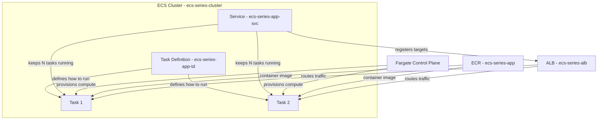
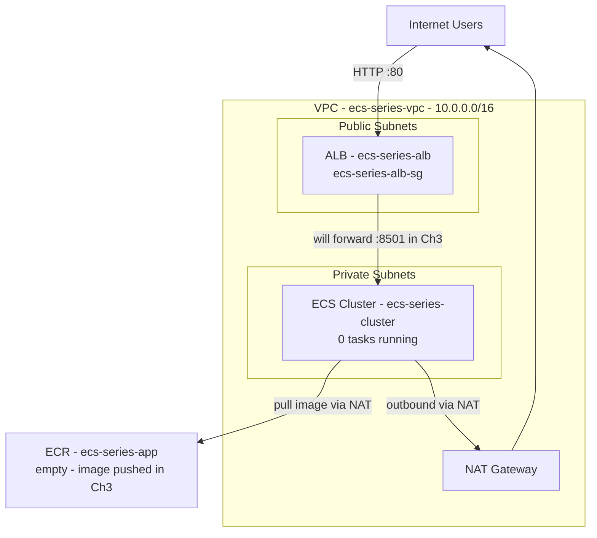

# Chapter 2 — ECS Core Components: Building the Foundation

Welcome to Chapter 2 of our AWS ECS series. Before we deploy a single container, we need to understand *what* ECS is made of — and build the shared infrastructure every later chapter will inherit.

In this chapter we cover the core ECS building blocks in theory, then roll up our sleeves and create the VPC, subnets, security groups, ECR repository, Application Load Balancer, and ECS cluster that will host our Streamlit app for the rest of the series.

**Region:** `eu-north-1` (Stockholm)  
**Launch type:** Fargate

---

## What You'll Learn

- What a Cluster, Task Definition, Task, and Service are — and how they relate to each other
- The difference between the ECS Container Agent (EC2) and the Fargate control plane
- How to create a production-style VPC with public and private subnets
- How to set up security groups, an ECR repo, an ALB, and an empty ECS cluster

---

## Theory: ECS Core Components

Think of ECS like a **restaurant chain**. You have a central kitchen (the cluster), standardized recipes (task definitions), individual plates going out (tasks), and a floor manager who keeps enough plates on the table (services). Let's break each piece down.

### Cluster

A **cluster** is a logical grouping of tasks and services. It is the top-level container (pun intended) inside ECS.

> **Analogy:** A cluster is the **warehouse** where all your operations happen. It does not run anything by itself — it is just the address where tasks and services live.

For Fargate, a cluster is mostly a namespace. You do not manage servers inside it; AWS handles the underlying compute.

### Task Definition

A **task definition** is a JSON blueprint that describes *how* to run your container: which image to use, how much CPU and memory to allocate, port mappings, environment variables, IAM roles, and more.

> **Analogy:** A task definition is the **recipe card** in the kitchen. It lists every ingredient and instruction, but nobody has cooked anything yet.

We will write our first task definition in Chapter 3. For now, know that every running container in ECS starts from one.

### Task

A **task** is a running instance of a task definition. When ECS launches a task, it pulls the container image, allocates compute, attaches networking, and starts the container.

> **Analogy:** A task is the **cooked dish** — one plate that came out of the kitchen following the recipe.

Tasks can run standalone (one-off jobs) or be managed by a service.

### Service

A **service** ensures that a specified number of tasks are always running. If a task crashes or is stopped, the service launches a replacement. Services can also register tasks with a load balancer so traffic is distributed evenly.

> **Analogy:** A service is the **floor manager** who keeps three plates of pasta on the table at all times. If a guest finishes one, the manager sends another from the kitchen immediately.

We will create our first service in Chapter 3.

### ECS Container Agent (EC2 launch type only)

When you run ECS on **EC2 instances** you manage yourself, each instance runs a small daemon called the **ECS Container Agent**. The agent talks to the ECS control plane, receives instructions ("start this task"), and manages containers on that host.

> **Analogy:** The container agent is the **on-site kitchen worker** on each EC2 server — the person who actually picks up orders and cooks them on that specific stove.

**Important:** If you use **Fargate** (which we do in this series), there is no container agent for you to manage. AWS runs it invisibly on their infrastructure.

### Fargate Control Plane

**AWS Fargate** is a serverless compute engine for containers. You define what you want in a task definition, and Fargate provisions the CPU, memory, and networking automatically. You never SSH into a host or patch an EC2 instance.

> **Analogy:** Fargate is the **fully managed kitchen staff**. You hand over the recipe card and say "make two of these." AWS hires the chefs, buys the stoves, and cleans up — you just pay per dish.

### How They Fit Together

---

## Hands-On: Create the Shared Infrastructure

Everything we build in this chapter is **shared infrastructure**. Chapters 3 and 4 will deploy services on top of it without tearing anything down.

### Prerequisites

- An AWS account with permissions for VPC, EC2, ECR, ELB, and ECS
- AWS CLI configured for region `eu-north-1` (optional but helpful)
- Make sure you are in the **eu-north-1** region in the AWS Console before starting

---

### Step 1 — Create the VPC and Subnets

We need an isolated network for our ECS tasks. A good pattern is:

- **Public subnets** — for the ALB (internet-facing)
- **Private subnets** — for ECS tasks (no direct internet access; outbound via NAT Gateway)

1. Open the **VPC Console** → **Create VPC**.
2. Select **VPC and more** (this wizard creates subnets, route tables, and a NAT Gateway in one go).
3. Configure:
   - **Name:** `ecs-series-vpc`
   - **IPv4 CIDR:** `10.0.0.0/16`
   - **Number of Availability Zones:** 2
   - **Number of public subnets:** 2
   - **Number of private subnets:** 2
   - **NAT gateways:** 1 (sufficient for a demo; use one per AZ in production)
   - **VPC endpoints:** None for now
4. Click **Create VPC** and wait for all resources to finish provisioning.

<!-- SCREENSHOT: VPC Console > Create VPC wizard with "VPC and more" selected, name ecs-series-vpc, CIDR 10.0.0.0/16, 2 AZs, 2 public + 2 private subnets, 1 NAT gateway -->

<!-- SCREENSHOT: VPC Console > Your VPCs list showing ecs-series-vpc with status Available -->

**Why private subnets for tasks?** Your Streamlit containers should not be directly reachable from the internet. Only the ALB sits in public subnets and forwards traffic inward.

---

### Step 2 — Create Security Groups

Security groups act as virtual firewalls. We need two:

| Security Group | Purpose | Inbound Rules |
|---|---|---|
| `ecs-series-alb-sg` | Attached to the ALB | TCP 80 from `0.0.0.0/0` |
| `ecs-series-app-sg` | Attached to ECS tasks | TCP 8501 from `ecs-series-alb-sg` only |

#### Create `ecs-series-alb-sg`

1. Go to **VPC Console** → **Security Groups** → **Create security group**.
2. Name: `ecs-series-alb-sg`
3. VPC: `ecs-series-vpc`
4. Inbound rule: **HTTP (80)** from **Anywhere-IPv4** (`0.0.0.0/0`)
5. Create the security group.

<!-- SCREENSHOT: Security Groups > ecs-series-alb-sg inbound rules showing HTTP port 80 from 0.0.0.0/0 -->

#### Create `ecs-series-app-sg`

1. Create another security group named `ecs-series-app-sg` in `ecs-series-vpc`.
2. Inbound rule: **Custom TCP (8501)** from source **`ecs-series-alb-sg`** (select the security group, not an IP range).
3. Leave outbound as default (all traffic allowed).

<!-- SCREENSHOT: Security Groups > ecs-series-app-sg inbound rules showing TCP 8501 from ecs-series-alb-sg -->

> **Analogy:** Security groups are **bouncers at different doors**. The ALB bouncer lets anyone from the internet in on port 80. The app bouncer only lets people who came through the ALB door in on port 8501.

---

### Step 3 — Create the ECR Repository

Amazon ECR (Elastic Container Registry) is where we store our Streamlit Docker image.

1. Open **ECR Console** → **Create repository**.
2. Configure:
   - **Visibility:** Private
   - **Repository name:** `ecs-series-app`
   - **Tag immutability:** Disabled (fine for a learning series)
   - **Scan on push:** Optional — enable if you want vulnerability scanning
3. Click **Create repository**.

<!-- SCREENSHOT: ECR Console > Repositories list showing ecs-series-app with URI like ACCOUNT.dkr.ecr.eu-north-1.amazonaws.com/ecs-series-app -->

Note the **URI** — you will need it in Chapter 3 when pushing your Streamlit image.

---

### Step 4 — Create the Application Load Balancer

The ALB sits in front of our ECS tasks and distributes incoming HTTP traffic.

#### 4a. Create the Target Group (do this first)

1. Go to **EC2 Console** → **Target Groups** → **Create target group**.
2. Configure:
   - **Target type:** IP addresses (required for Fargate `awsvpc` mode)
   - **Target group name:** `ecs-series-tg`
   - **Protocol:** HTTP
   - **Port:** `8501` (Streamlit's default port)
   - **VPC:** `ecs-series-vpc`
   - **Health check path:** `/_stcore/health` (Streamlit's built-in health endpoint)
   - **Health check interval:** 30 seconds
3. Under **Attributes**, enable **Stickiness** (Streamlit uses WebSocket sessions — without stickiness, users may hit different tasks and lose their session).
4. Skip registering targets for now — ECS will register task IPs automatically when we create the service in Chapter 3.
5. Create the target group.

<!-- SCREENSHOT: Target Groups > ecs-series-tg details showing target type IP, port 8501, health check path /_stcore/health, stickiness enabled -->

#### 4b. Create the ALB

1. Go to **EC2 Console** → **Load Balancers** → **Create load balancer** → **Application Load Balancer**.
2. Configure:
   - **Name:** `ecs-series-alb`
   - **Scheme:** Internet-facing
   - **IP address type:** IPv4
   - **VPC:** `ecs-series-vpc`
   - **Mappings:** Select both **public subnets** (one per AZ)
   - **Security group:** `ecs-series-alb-sg`
3. **Listeners:** HTTP on port 80 → forward to `ecs-series-tg`
4. Create the load balancer and wait until the state is **Active**.

<!-- SCREENSHOT: Load Balancers > ecs-series-alb showing state Active, scheme internet-facing, two public subnets selected -->

<!-- SCREENSHOT: ALB Listeners tab showing HTTP:80 forwarding to ecs-series-tg -->

Copy the **DNS name** of the ALB (e.g., `ecs-series-alb-123456789.eu-north-1.elb.amazonaws.com`). We will use it in Chapter 3 to verify the app is running.

---

### Step 5 — Create the ECS Cluster

Finally, create the empty cluster that will hold our services.

1. Open **ECS Console** → **Clusters** → **Create cluster**.
2. Configure:
   - **Cluster name:** `ecs-series-cluster`
   - **Infrastructure:** Leave default AWS Fargate (serverless) selected
   - No EC2 capacity providers needed
3. Click **Create**.

<!-- SCREENSHOT: ECS Console > Clusters list showing ecs-series-cluster with 0 services and 0 running tasks -->

The cluster is empty — that is expected. We have built the stage; in Chapter 3 we bring the actors.

---

### Step 6 — Verify Everything Is in Place

Before moving on, confirm all resources exist:

| Resource | Name | Status |
|---|---|---|
| VPC | `ecs-series-vpc` | Available |
| Public subnets | 2 across 2 AZs | Available |
| Private subnets | 2 across 2 AZs | Available |
| NAT Gateway | 1 | Available |
| Security group (ALB) | `ecs-series-alb-sg` | Created |
| Security group (App) | `ecs-series-app-sg` | Created |
| ECR repository | `ecs-series-app` | Created |
| Target group | `ecs-series-tg` | Created (0 targets — expected) |
| Load balancer | `ecs-series-alb` | Active |
| ECS cluster | `ecs-series-cluster` | Active, 0 services |

<!-- SCREENSHOT: Collage or single screenshot showing ECS cluster overview with 0 services, 0 tasks, alongside ALB DNS name visible -->

If every row checks out, your foundation is ready.

---

## Architecture at the End of Chapter 2

Nothing is deployed yet — and that is exactly where we want to be.

---

## What's Next

In **Chapter 3 — Writing and Deploying a Task Definition**, we will:

- Build a small Streamlit app and push it to `ecs-series-app` in ECR
- Write our first task definition (`ecs-series-app-td`)
- Create a service (`ecs-series-app-svc`) that keeps two tasks running behind the ALB
- Open the ALB DNS name in a browser and see our app live

See you in the next chapter.
