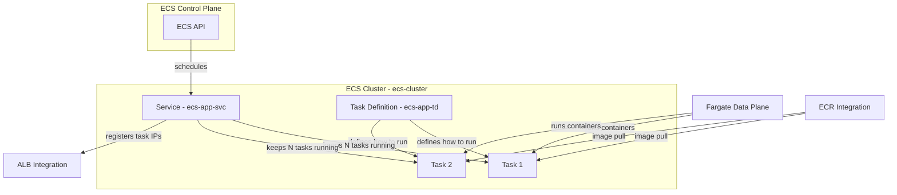
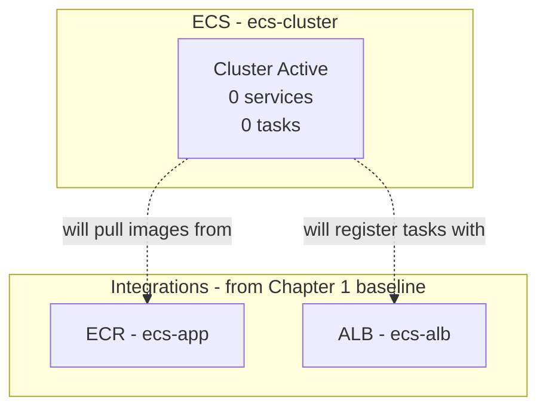

# Chapter 2 — ECS Core Components: Building the Foundation

Welcome to Chapter 2 of our AWS ECS series. This chapter is about **ECS itself** — the building blocks you will use in every deployment, and the empty cluster that holds them.

We are not covering VPC design, load balancers, or container registry setup here. Chapter 1 (or your own baseline environment) handles that. This chapter answers: *What is ECS made of, and how do I create a cluster ready to receive services?*

**Region:** `eu-north-1` (or your preferred region)  
**Launch type:** Fargate

---

## What You'll Learn

- What a Cluster, Task Definition, Task, and Service are — and how they relate
- The difference between the ECS control plane and the data plane
- Why the Container Agent matters for EC2 but not for Fargate
- How Fargate fits into the ECS model
- How to create an ECS cluster and navigate the ECS console

---

## Theory: ECS Core Components

Think of ECS like a **restaurant chain**. You have a central kitchen (the cluster), standardized recipes (task definitions), individual plates going out (tasks), and a floor manager who keeps enough plates on the table (services).

### Cluster

A **cluster** is a logical grouping of tasks and services inside ECS. It is the top-level container (pun intended) where your workloads live.

> **Analogy:** A cluster is the **warehouse** where all your operations happen. It does not run anything by itself — it is the address where tasks and services are registered.

For Fargate, a cluster is mostly a namespace. You do not register EC2 instances or manage hosts. AWS handles the underlying compute when you launch tasks.

### Task Definition

A **task definition** is a JSON blueprint that describes *how* to run your container: image, CPU, memory, port mappings, environment variables, IAM roles, logging, and more.

> **Analogy:** A task definition is the **recipe card** in the kitchen. It lists every ingredient and instruction, but nobody has cooked anything yet.

Every running container in ECS starts from a task definition. We write our first one in Chapter 3.

### Task

A **task** is a running instance of a task definition. When ECS launches a task, it pulls the container image, allocates compute, attaches networking, and starts the container.

> **Analogy:** A task is the **cooked dish** — one plate that came out of the kitchen following the recipe.

Tasks can run standalone (one-off jobs) or be managed by a service.

### Service

A **service** ensures that a specified number of tasks are always running. If a task crashes or is stopped, the service launches a replacement. Services can also integrate with a load balancer so traffic reaches healthy tasks automatically.

> **Analogy:** A service is the **floor manager** who keeps two plates of pasta on the table at all times. If one is cleared, the manager sends another from the kitchen immediately.

We create our first service in Chapter 3.

### ECS Control Plane vs Data Plane

ECS has two layers worth separating in your mental model:

| Layer | What it does | Who runs it |
|---|---|---|
| **Control plane** | Schedules tasks, tracks state, manages services, talks to integrations | AWS (ECS API) |
| **Data plane** | Actually runs your containers | Fargate (this series) or EC2 instances you manage |

When you click "Create service" in the console, you talk to the **control plane**. The control plane then tells the **data plane** to start tasks according to your task definition.

> **Analogy:** The control plane is the **restaurant manager** taking orders. The data plane is the **kitchen** that cooks them.

### ECS Container Agent (EC2 launch type only)

When you run ECS on **EC2 instances** you manage yourself, each instance runs a daemon called the **ECS Container Agent**. The agent receives instructions from the ECS control plane and starts or stops containers on that host.

> **Analogy:** The container agent is the **on-site kitchen worker** on each EC2 server — the person who actually picks up orders and cooks them on that specific stove.

**Important:** With **Fargate**, there is no container agent for you to install or manage. AWS runs it invisibly.

### Fargate Control Plane

**AWS Fargate** is a serverless compute engine for containers. You define what you want in a task definition, and Fargate provisions CPU, memory, and networking automatically. You never SSH into a host or patch an EC2 instance.

> **Analogy:** Fargate is the **fully managed kitchen staff**. You hand over the recipe card and say "make two of these." AWS handles the rest — you pay per task.

### ECS Integrations (Not ECS Core)

ECS works with other AWS services, but they are **integrations**, not ECS components:

| Integration | Role in ECS |
|---|---|
| **ECR** | Stores container images your task definition references |
| **Application Load Balancer** | Routes external traffic to tasks registered by a service |
| **CloudWatch Logs** | Receives stdout/stderr from running containers |
| **VPC / subnets / security groups** | Networking context where tasks run (`awsvpc` mode) |

You need these in a real deployment, but they are configured outside the ECS object model. Chapter 1 covers that baseline; this series focuses on what happens inside ECS.

### How They Fit Together

---

## Hands-On: Create Your ECS Cluster

### Prerequisites

> *This is an ECS series. We assume you already have a VPC with public and private subnets, an internet-facing ALB with a target group, security groups, and an ECR repository with your app image. Chapter 1 (or your own baseline) covers that setup.*

You will need:

- An AWS account with ECS permissions
- AWS Console open in your preferred region (we use `eu-north-1`)
- Baseline resources ready: `ecs-vpc`, `ecs-alb`, `ecs-tg`, `ecs-app-sg`, ECR repo `ecs-app`

---

### Step 1 — Create the ECS Cluster

1. Open the **ECS Console** → **Clusters** → **Create cluster**.
2. Configure:
   - **Cluster name:** `ecs-cluster`
   - **Infrastructure:** Select **AWS Fargate (serverless)** — no EC2 capacity providers needed for this series
3. Click **Create**.

<!-- SCREENSHOT: ECS Console > Create cluster page with name ecs-cluster and AWS Fargate selected -->

**What "empty cluster" means:** A cluster with zero services and zero tasks is normal. The cluster is a logical container — it becomes useful once you add task definitions and services in Chapter 3.

**Capacity providers note:** With Fargate, you do not register EC2 instances. ECS provisions Fargate capacity on demand when a service needs tasks. If you later use EC2 launch type, you would add capacity providers to tell ECS which EC2 instances are available.

---

### Step 2 — Tour the ECS Console

Before deploying anything, orient yourself in the ECS console. Open `ecs-cluster` and explore each section:

| Console section | What it holds | When you'll use it |
|---|---|---|
| **Services** | Long-running workloads (e.g., your Streamlit app) | Chapter 3 |
| **Tasks** | Individual running containers | Chapter 3 — watch lifecycle here |
| **Metrics** | CPU, memory, task count | Later chapters |
| **Service Connect** | Service-to-service DNS and proxy config | Chapter 4 |
| **Task definitions** (left nav) | Blueprints for how containers run | Chapter 3 |
| **Clusters** (left nav) | All clusters in the account | Now |

<!-- SCREENSHOT: ECS Console > ecs-cluster overview showing Services, Tasks, Metrics tabs with 0 services and 0 running tasks -->

<!-- SCREENSHOT: ECS Console left navigation highlighting Clusters and Task definitions -->

Click into **Task definitions** in the left nav. It will be empty or show definitions from other projects — that is fine. In Chapter 3 you create `ecs-app-td`.

---

### Step 3 — Verify Cluster Readiness

Confirm your cluster is ready to receive services:

| Check | Expected |
|---|---|
| Cluster status | Active |
| Services | 0 |
| Running tasks | 0 |
| Infrastructure | Fargate |

<!-- SCREENSHOT: ECS Console > ecs-cluster detail page showing Active status, 0 services, 0 running tasks, Fargate infrastructure -->

Your ECS foundation is ready. The cluster exists; task definitions and services come next.

---

## Architecture at the End of Chapter 2

Nothing is deployed yet — and that is exactly where we want to be.

---

## What's Next

In **Chapter 3 — Writing and Deploying a Task Definition**, we will:

- Create our first task definition (`ecs-app-td`)
- Deploy a service (`ecs-app-svc`) that keeps two Fargate tasks running
- Watch tasks move through the ECS lifecycle
- Verify the deployment from the ECS console

See you in the next chapter.
