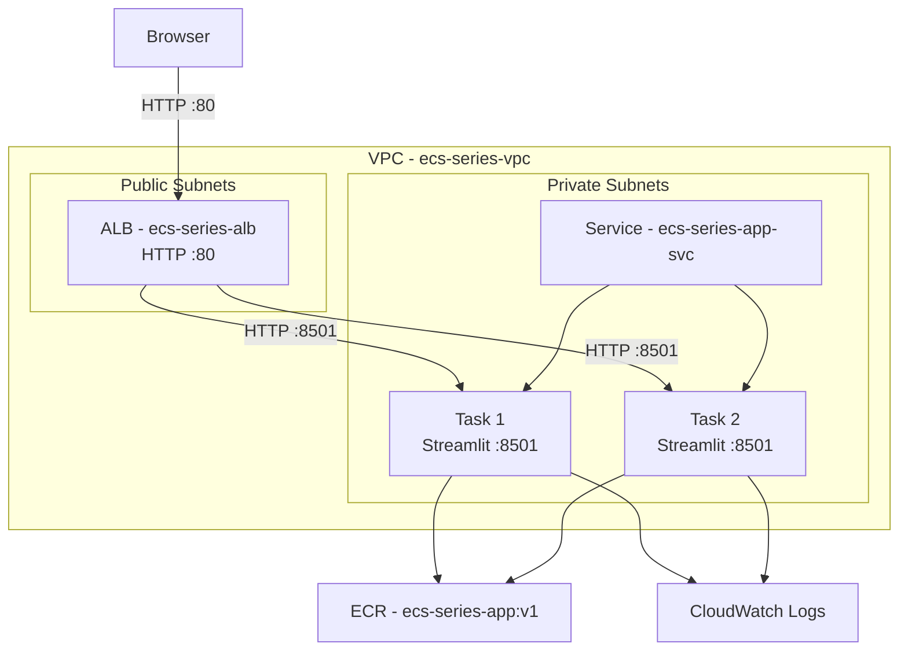

# Chapter 3 — Writing and Deploying a Task Definition

In Chapter 2 we built the stage — VPC, subnets, security groups, ECR, ALB, and an empty ECS cluster. Now it is time to bring the actors: a Streamlit app running as an ECS service behind the load balancer.

This chapter covers the task definition in theory — container config, CPU/memory, port mappings, environment variables, and image pull — then walks through building the app, pushing it to ECR, and deploying it to Fargate.

**Region:** `eu-north-1` (Stockholm)  
**Launch type:** Fargate  
**App:** Streamlit on port `8501`

---

## What You'll Learn

- What a task definition contains and why it matters
- How Fargate CPU and memory allocation works
- How port mappings and environment variables are configured
- How ECS pulls images from ECR using an execution role
- How to deploy a service and verify it through the ALB DNS name

---

## Theory: The Task Definition

### What Is a Task Definition?

A **task definition** is the complete specification for running one or more containers as a single ECS task. It is stored as a JSON document (or configured through the console) and versioned — every revision gets a number (`ecs-series-app-td:1`, `:2`, etc.).

> **Analogy:** If the cluster is the warehouse and the service is the floor manager, the task definition is the **printed recipe card** taped to the kitchen wall. It tells everyone exactly what goes into every dish.

Key sections of a task definition:

| Section | What it defines |
|---|---|
| **Launch type** | Fargate or EC2 |
| **Network mode** | How the task gets networking (`awsvpc` for Fargate) |
| **CPU / Memory** | Compute allocated to the task |
| **Container definitions** | Image, ports, env vars, logging |
| **Task role** | Permissions the running app needs (e.g., S3 access) |
| **Execution role** | Permissions ECS needs to start the task (e.g., pull from ECR) |

### Container Configuration

Each container in a task definition specifies:

- **Image** — the URI of the Docker image in ECR (or Docker Hub)
- **Essential** — if `true`, the task stops when this container stops
- **Port mappings** — which ports the container exposes
- **Environment variables** — key-value pairs injected at startup
- **Logging** — where container stdout/stderr goes (CloudWatch Logs)

> **Analogy:** The container definition is the **ingredients section** of the recipe — image is the main ingredient, env vars are the seasoning, port mappings are which window the food is served from.

### CPU and Memory in Fargate

Unlike EC2 where you pick an instance type, Fargate gives you **pre-set portion sizes**. You choose a CPU and memory combination from a fixed table. Common pairings:

| vCPU | Memory options |
|---|---|
| 0.25 | 0.5 GB, 1 GB, 2 GB |
| 0.5 | 1 GB – 4 GB (in 1 GB steps) |
| 1 | 2 GB – 8 GB (in 1 GB steps) |
| 2 | 4 GB – 16 GB (in 1 GB steps) |

For our Streamlit demo we use **0.5 vCPU / 1 GB** — enough headroom for Python and Streamlit without over-provisioning.

> **Analogy:** Fargate portion sizes are like a **fixed menu** — you cannot order "0.3 vCPU with 1.7 GB." You pick from the combos on the card.

### Port Mappings

Port mappings tell ECS which port inside the container should be reachable from outside the task. For Fargate with `awsvpc` mode, the container port is exposed directly on the task's ENI.

```
Container port 8501  →  Task ENI port 8501  →  ALB target group port 8501
```

All three must match for traffic to flow correctly.

> **Analogy:** Port mappings are the **service window number** — customers (the ALB) need to know which window to pick up from.

### Environment Variables

Environment variables are injected into the container at startup. They are ideal for non-secret configuration like app version, feature flags, or environment name (`dev` / `prod`).

For secrets (database passwords, API keys), use **AWS Secrets Manager** or **SSM Parameter Store** with the `secrets` block in the task definition — not plain env vars.

> **Analogy:** Environment variables are **sticky notes on the recipe card** — "use version v1 today" or "this is the staging kitchen."

### Image Pull and the Execution Role

When ECS starts a task, it must:

1. Pull the container image from ECR
2. Write logs to CloudWatch
3. Optionally fetch secrets from Secrets Manager

These actions require permissions. The **task execution role** (`ecsTaskExecutionRole`) grants ECS the IAM permissions to do this on your behalf. AWS creates this role automatically the first time you use ECS in an account.

> **Analogy:** The execution role is the **kitchen's access badge** — it lets ECS walk into the ECR pantry, grab the ingredients (image), and log what happened in the kitchen journal (CloudWatch).

### Task vs. Execution Role (Quick Distinction)

| Role | Who uses it | Example permissions |
|---|---|---|
| **Execution role** | ECS agent / Fargate platform | Pull ECR image, write CloudWatch logs |
| **Task role** | Your running application code | Read S3 bucket, publish to SNS |

For this chapter we only need the execution role.

---

## Hands-On: Build, Push, and Deploy the Streamlit App

### Prerequisites

- Chapter 2 infrastructure completed (`ecs-series-vpc`, `ecs-series-alb`, `ecs-series-cluster`, etc.)
- Docker installed locally
- AWS CLI configured for `eu-north-1`

---

### Step 1 — Create the Streamlit App

Create a small project folder with three files.

**`streamlit_app.py`**

```python
import os
import streamlit as st

APP_VERSION = os.getenv("APP_VERSION", "unknown")

st.set_page_config(page_title="ECS Series App", page_icon="🚀")
st.title("Hello from ECS!")
st.write(f"Running on AWS Fargate in eu-north-1")
st.info(f"App version: **{APP_VERSION}**")
st.success("If you can see this page, your ECS service is working.")
```

**`requirements.txt`**

```
streamlit==1.32.0
```

**`Dockerfile`**

```dockerfile
FROM python:3.11-slim

WORKDIR /app

COPY requirements.txt .
RUN pip install --no-cache-dir -r requirements.txt

COPY streamlit_app.py .

EXPOSE 8501

CMD ["streamlit", "run", "streamlit_app.py", \
     "--server.port=8501", \
     "--server.address=0.0.0.0", \
     "--server.headless=true"]
```

Build locally to confirm it works:

```bash
docker build -t ecs-series-app:local .
docker run -p 8501:8501 -e APP_VERSION=local ecs-series-app:local
```

Open `http://localhost:8501` — you should see the Hello page.

<!-- SCREENSHOT: Browser showing Streamlit app running locally with "Hello from ECS!" and App version: local -->

---

### Step 2 — Push the Image to ECR

Replace `ACCOUNT_ID` with your AWS account ID throughout.

**Authenticate Docker to ECR:**

```bash
aws ecr get-login-password --region eu-north-1 | \
  docker login --username AWS --password-stdin \
  ACCOUNT_ID.dkr.ecr.eu-north-1.amazonaws.com
```

**Tag and push:**

```bash
docker tag ecs-series-app:local \
  ACCOUNT_ID.dkr.ecr.eu-north-1.amazonaws.com/ecs-series-app:v1

docker push \
  ACCOUNT_ID.dkr.ecr.eu-north-1.amazonaws.com/ecs-series-app:v1
```

<!-- SCREENSHOT: Terminal showing successful docker push output with digest -->

<!-- SCREENSHOT: ECR Console > ecs-series-app repository showing image tag v1 with push timestamp -->

---

### Step 3 — Create the Task Definition

1. Open **ECS Console** → **Task definitions** → **Create new task definition** → **Create new task definition with JSON** (or use the wizard — both work).
2. Configure:

| Setting | Value |
|---|---|
| Task definition family | `ecs-series-app-td` |
| Launch type | AWS Fargate |
| Operating system | Linux |
| CPU | 0.5 vCPU |
| Memory | 1 GB |
| Task role | None (not needed yet) |
| Task execution role | `ecsTaskExecutionRole` |
| Network mode | awsvpc (automatic for Fargate) |

3. Add a container:

| Setting | Value |
|---|---|
| Container name | `app` |
| Image URI | `ACCOUNT_ID.dkr.ecr.eu-north-1.amazonaws.com/ecs-series-app:v1` |
| Essential | Yes |
| Port mapping | Container port `8501`, protocol TCP |
| Environment variable | Key: `APP_VERSION`, Value: `v1` |
| Log configuration | Auto-configure CloudWatch log group (recommended) |

4. Create the task definition.

<!-- SCREENSHOT: ECS Console > Task definition ecs-series-app-td:1 showing Fargate, 0.5 vCPU, 1 GB, container app with port 8501 -->

<!-- SCREENSHOT: Container details showing image URI, APP_VERSION env var, and port mapping 8501 -->

The resulting JSON looks roughly like this:

```json
{
  "family": "ecs-series-app-td",
  "networkMode": "awsvpc",
  "requiresCompatibilities": ["FARGATE"],
  "cpu": "512",
  "memory": "1024",
  "executionRoleArn": "arn:aws:iam::ACCOUNT_ID:role/ecsTaskExecutionRole",
  "containerDefinitions": [
    {
      "name": "app",
      "image": "ACCOUNT_ID.dkr.ecr.eu-north-1.amazonaws.com/ecs-series-app:v1",
      "essential": true,
      "portMappings": [
        {
          "containerPort": 8501,
          "protocol": "tcp"
        }
      ],
      "environment": [
        {
          "name": "APP_VERSION",
          "value": "v1"
        }
      ],
      "logConfiguration": {
        "logDriver": "awslogs",
        "options": {
          "awslogs-group": "/ecs/ecs-series-app-td",
          "awslogs-region": "eu-north-1",
          "awslogs-stream-prefix": "app"
        }
      }
    }
  ]
}
```

---

### Step 4 — Create the ECS Service

Now connect the task definition to the cluster and the ALB.

1. Go to **ECS Console** → **Clusters** → `ecs-series-cluster` → **Create**.
2. Select **Service**.
3. Configure:

| Setting | Value |
|---|---|
| Compute options | Launch type → Fargate |
| Application type | Service |
| Task definition | `ecs-series-app-td:1` |
| Service name | `ecs-series-app-svc` |
| Desired tasks | `2` |

4. **Deployment configuration:** Rolling update (defaults are fine).

5. **Networking:**

| Setting | Value |
|---|---|
| VPC | `ecs-series-vpc` |
| Subnets | Both **private subnets** |
| Security group | `ecs-series-app-sg` |
| Public IP | **Turn OFF** (tasks reach ECR via NAT Gateway) |

6. **Load balancing:**

| Setting | Value |
|---|---|
| Load balancer type | Application Load Balancer |
| Load balancer | `ecs-series-alb` |
| Listener | HTTP:80 |
| Target group | `ecs-series-tg` |
| Health check grace period | 60 seconds |

7. Create the service.

<!-- SCREENSHOT: Create service wizard showing task definition, 2 desired tasks, private subnets, ecs-series-app-sg, ALB ecs-series-alb attached -->

ECS will now:
1. Pull the image from ECR
2. Launch 2 Fargate tasks in the private subnets
3. Register their private IPs with the ALB target group

---

### Step 5 — Watch Tasks Come Up

1. In the cluster, open the **Tasks** tab.
2. Watch each task move through the lifecycle:

```
PROVISIONING → PENDING → RUNNING
```

This typically takes 1–3 minutes on first deploy.

<!-- SCREENSHOT: ECS Console > ecs-series-cluster Tasks tab showing 2 tasks in RUNNING state -->

3. Open the **Services** tab → `ecs-series-app-svc` → check the **Events** tab for any errors.

Common first-deploy issues:

| Symptom | Likely cause |
|---|---|
| Task stops immediately | Wrong image URI, or execution role missing ECR permissions |
| Task stuck in PENDING | Not enough IP addresses in subnet, or insufficient Fargate capacity |
| Target unhealthy | Security group blocking port 8501, or wrong health check path |

4. Go to **EC2 Console** → **Target Groups** → `ecs-series-tg` → **Targets** tab. Both task IPs should show **healthy**.

<!-- SCREENSHOT: Target group ecs-series-tg Targets tab showing 2 healthy targets on port 8501 -->

---

### Step 6 — Verify via the ALB DNS Name

1. Copy the DNS name of `ecs-series-alb` from the EC2 Load Balancers console.
2. Open it in a browser: `http://ecs-series-alb-XXXXXXXXXX.eu-north-1.elb.amazonaws.com`

You should see the Streamlit page with "Hello from ECS!" and "App version: v1".

<!-- SCREENSHOT: Browser showing Streamlit app loaded via ALB DNS with Hello from ECS and App version v1 -->

3. Confirm health from the command line:

```bash
curl -s -o /dev/null -w "%{http_code}" \
  http://ecs-series-alb-XXXXXXXXXX.eu-north-1.elb.amazonaws.com/_stcore/health
```

Expected output: `200`

<!-- SCREENSHOT: Terminal showing curl health check returning HTTP 200 -->

Congratulations — you have a Streamlit app running on Fargate, load-balanced across two tasks, with no servers to manage.

---

## Architecture After Chapter 3



---

## What's Next

In **Chapter 4 — Networking in ECS**, we go deeper into how tasks get their own network identity:

- `awsvpc` network mode and ENI-per-task
- Security group rules at the task level
- **Service Connect** — friendly DNS names for service-to-service communication
- **Cloud Map** — the private DNS registry behind it all

We will add a second backend service and prove that our Streamlit app can reach it by name — no hard-coded IPs required.

See you in the next chapter.
