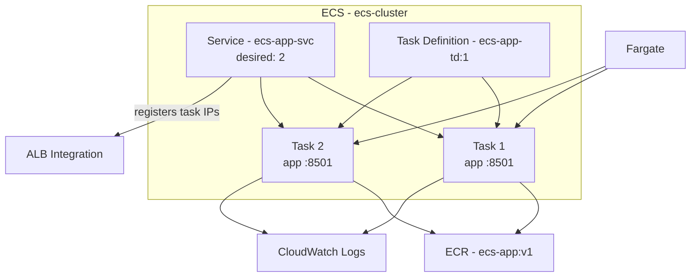

# Chapter 3 — Writing and Deploying a Task Definition

In Chapter 2 we created an empty ECS cluster and learned the core components. Now we put them to work: define *how* a container runs (task definition), then tell ECS to keep it running (service).

This chapter is entirely about **ECS objects** — task definitions, services, and tasks. We assume your container image is already in ECR and your baseline networking exists from Chapter 1.

**Region:** `eu-north-1` (or your preferred region)  
**Launch type:** Fargate  
**App:** Streamlit on port `8501`

---

## What You'll Learn

- What a task definition contains and why it matters
- How Fargate CPU and memory allocation works
- How port mappings and environment variables are configured
- How ECS pulls images using the task execution role
- How to create a service, watch the task lifecycle, and verify a deployment from the ECS console

---

## Theory: The Task Definition

### What Is a Task Definition?

A **task definition** is the complete specification for running one or more containers as a single ECS task. It is stored as a JSON document (or configured through the console) and versioned — every revision gets a number (`ecs-app-td:1`, `:2`, etc.).

> **Analogy:** If the cluster is the warehouse and the service is the floor manager, the task definition is the **printed recipe card** taped to the kitchen wall.

Key sections of a task definition:

| Section | What it defines |
|---|---|
| **Launch type** | Fargate or EC2 |
| **Network mode** | How the task gets networking (`awsvpc` for Fargate) |
| **CPU / Memory** | Compute allocated to the task |
| **Container definitions** | Image, ports, env vars, logging |
| **Task role** | Permissions the running app needs (e.g., S3 access) |
| **Execution role** | Permissions ECS needs to start the task (e.g., pull from ECR, write logs) |

### Container Configuration

Each container in a task definition specifies:

- **Image** — the URI of the Docker image in ECR
- **Essential** — if `true`, the task stops when this container stops
- **Port mappings** — which ports the container exposes on the task ENI
- **Environment variables** — key-value pairs injected at startup
- **Logging** — where container stdout/stderr goes (CloudWatch Logs)

> **Analogy:** The container definition is the **ingredients section** of the recipe — image is the main ingredient, env vars are the seasoning, port mappings are which window the food is served from.

### CPU and Memory in Fargate

Unlike EC2 where you pick an instance type, Fargate gives you **pre-set portion sizes**. You choose a CPU and memory combination from a fixed table:

| vCPU | Memory options |
|---|---|
| 0.25 | 0.5 GB, 1 GB, 2 GB |
| 0.5 | 1 GB – 4 GB (in 1 GB steps) |
| 1 | 2 GB – 8 GB (in 1 GB steps) |
| 2 | 4 GB – 16 GB (in 1 GB steps) |

For our Streamlit demo we use **0.5 vCPU / 1 GB**.

> **Analogy:** Fargate portion sizes are like a **fixed menu** — you pick from the combos on the card.

### Port Mappings

Port mappings tell ECS which port inside the container is exposed on the task's ENI (Elastic Network Interface). In Fargate with `awsvpc` mode:

```
Container port 8501  →  Task ENI port 8501
```

When you attach a load balancer to a service, ECS registers the task's private IP and container port with the target group — that is a **service integration**, not part of the task definition itself.

> **Analogy:** Port mappings are the **service window number** on the task — they tell ECS which door traffic can knock on.

### Environment Variables

Environment variables are injected into the container at startup. Use them for non-secret configuration like app version or environment name.

For secrets (database passwords, API keys), use **AWS Secrets Manager** or **SSM Parameter Store** with the `secrets` block in the task definition — not plain env vars.

> **Analogy:** Environment variables are **sticky notes on the recipe card** — "use version v1 today."

### Image Pull and the Execution Role

When ECS starts a task, the platform must:

1. Pull the container image from ECR
2. Write logs to CloudWatch
3. Optionally fetch secrets from Secrets Manager

The **task execution role** (`ecsTaskExecutionRole`) grants ECS these permissions. AWS creates this role automatically the first time you use ECS in an account.

> **Analogy:** The execution role is the **kitchen's access badge** — it lets ECS grab the image from ECR and write to CloudWatch.

### Task vs. Execution Role

| Role | Who uses it | Example permissions |
|---|---|---|
| **Execution role** | ECS platform (starting the task) | Pull ECR image, write CloudWatch logs |
| **Task role** | Your running application code | Read S3 bucket, publish to SNS |

For this chapter we only need the execution role.

---

## Hands-On: Deploy Your First ECS Service

### Prerequisites

> *This is an ECS series. We assume you already have a VPC with public and private subnets, an internet-facing ALB with target group `ecs-tg`, security group `ecs-app-sg`, and an ECR repo `ecs-app` with your Streamlit image tagged `v1`. Chapter 1 covers that baseline.*

You also need:

- ECS cluster `ecs-cluster` from Chapter 2
- Image URI: `ACCOUNT_ID.dkr.ecr.AWS_REGION.amazonaws.com/ecs-app:v1`

---

### Step 1 — Confirm Your Image in ECR

This chapter focuses on ECS deployment, not building containers. Make sure your image is already pushed to ECR before creating the task definition.

<!-- SCREENSHOT: ECR Console > ecs-app repository showing image tag v1 exists (optional confirmation only) -->

If you need to build and push an image, follow your container workflow outside this chapter — then return here.

---

### Step 2 — Create the Task Definition

1. Open **ECS Console** → **Task definitions** → **Create new task definition**.
2. Configure the task:

| Setting | Value |
|---|---|
| Task definition family | `ecs-app-td` |
| Launch type | AWS Fargate |
| Operating system | Linux |
| CPU | 0.5 vCPU |
| Memory | 1 GB |
| Task role | None (not needed yet) |
| Task execution role | `ecsTaskExecutionRole` |
| Network mode | awsvpc (automatic for Fargate) |

3. Add a container:

| Setting | Value |
|---|---|
| Container name | `app` |
| Image URI | `ACCOUNT_ID.dkr.ecr.AWS_REGION.amazonaws.com/ecs-app:v1` |
| Essential | Yes |
| Port mapping | Container port `8501`, protocol TCP |
| Environment variable | Key: `APP_VERSION`, Value: `v1` |
| Log configuration | Auto-configure CloudWatch log group |

4. Create the task definition.

<!-- SCREENSHOT: ECS Console > Task definition ecs-app-td:1 overview showing Fargate, 0.5 vCPU, 1 GB, awsvpc -->

<!-- SCREENSHOT: ECS Console > Container app details showing image URI, port 8501, APP_VERSION env var, awslogs configuration -->

The resulting JSON looks roughly like this:

```json
{
  "family": "ecs-app-td",
  "networkMode": "awsvpc",
  "requiresCompatibilities": ["FARGATE"],
  "cpu": "512",
  "memory": "1024",
  "executionRoleArn": "arn:aws:iam::ACCOUNT_ID:role/ecsTaskExecutionRole",
  "containerDefinitions": [
    {
      "name": "app",
      "image": "ACCOUNT_ID.dkr.ecr.AWS_REGION.amazonaws.com/ecs-app:v1",
      "essential": true,
      "portMappings": [
        {
          "containerPort": 8501,
          "protocol": "tcp"
        }
      ],
      "environment": [
        {
          "name": "APP_VERSION",
          "value": "v1"
        }
      ],
      "logConfiguration": {
        "logDriver": "awslogs",
        "options": {
          "awslogs-group": "/ecs/ecs-app-td",
          "awslogs-region": "eu-north-1",
          "awslogs-stream-prefix": "app"
        }
      }
    }
  ]
}
```

**Revision note:** Every time you change the task definition and create a new revision (`ecs-app-td:2`), existing services do not automatically pick it up — you update the service to use the new revision.

---

### Step 3 — Create the ECS Service

A service connects your task definition to the cluster and keeps the desired number of tasks running.

1. Go to **ECS Console** → **Clusters** → `ecs-cluster` → **Create** → **Service**.
2. Configure:

| Setting | Value |
|---|---|
| Compute options | Launch type → Fargate |
| Application type | Service |
| Task definition | `ecs-app-td:1` |
| Service name | `ecs-app-svc` |
| Desired tasks | `2` |

3. **Deployment configuration:** Rolling update (defaults are fine).

4. **Networking** (select existing resources — do not create new ones here):

| Setting | Value |
|---|---|
| VPC | `ecs-vpc` |
| Subnets | Private subnets |
| Security group | `ecs-app-sg` |
| Public IP | OFF |

5. **Load balancing** (ECS integration with your existing ALB):

| Setting | Value |
|---|---|
| Load balancer type | Application Load Balancer |
| Load balancer | `ecs-alb` |
| Listener | HTTP:80 |
| Target group | `ecs-tg` |
| Container to load balance | `app:8501` |
| Health check grace period | 60 seconds |

When you create the service, ECS automatically **registers each task's private IP** with the target group. You do not manually add targets — that is ECS doing its job.

6. Create the service.

<!-- SCREENSHOT: ECS Console > Create service wizard showing ecs-app-td:1, service name ecs-app-svc, desired count 2 -->

<!-- SCREENSHOT: ECS Console > Create service networking section showing private subnets and ecs-app-sg selected -->

<!-- SCREENSHOT: ECS Console > Create service load balancing section showing ecs-alb and ecs-tg attached to container app:8501 -->

---

### Step 4 — Watch the Task Lifecycle

1. In the cluster, open the **Tasks** tab.
2. Watch each task move through the ECS lifecycle:

```
PROVISIONING → PENDING → RUNNING
```

This typically takes 1–3 minutes on first deploy.

<!-- SCREENSHOT: ECS Console > ecs-cluster Tasks tab showing 2 tasks transitioning to RUNNING -->

3. Open **Services** → `ecs-app-svc` → **Events** tab. This is your first stop when something goes wrong — ECS writes scheduling, placement, and health events here.

<!-- SCREENSHOT: ECS Console > ecs-app-svc Events tab showing successful task launches and target registration -->

4. Open the **Tasks** tab inside the service. Click a task ID to see:
   - **Configuration** — which task definition revision is running
   - **Logs** — CloudWatch output from the container
   - **Networking** — private IP, ENI, subnet, security group

<!-- SCREENSHOT: ECS Console > individual task detail showing RUNNING status, private IP, and link to CloudWatch logs -->

**Common first-deploy issues (ECS perspective):**

| Symptom | Likely cause |
|---|---|
| Task stops immediately | Wrong image URI, or execution role missing ECR permissions |
| Task stuck in PENDING | Insufficient Fargate capacity, or subnet out of IP addresses |
| Service running but tasks cycling | Container crashing on startup — check CloudWatch logs |
| Service events show "unable to place task" | CPU/memory combo invalid, or no subnets selected |

---

### Step 5 — Verify the Deployment

**Primary verification — ECS console:**

| Check | Where to look | Expected |
|---|---|---|
| Service status | Services → `ecs-app-svc` | Active, desired 2, running 2 |
| Task health | Tasks tab | 2 tasks in RUNNING |
| Events | Service Events tab | No errors; tasks registered with target group |
| Logs | Task → Logs | Streamlit startup messages in CloudWatch |

<!-- SCREENSHOT: ECS Console > ecs-app-svc overview showing 2/2 tasks running, deployment successful -->

**Secondary verification:** Open your existing ALB URL in a browser — you should see the Streamlit app. That confirms the full path works, but the ECS console is the source of truth for this chapter.

<!-- SCREENSHOT: Browser showing Streamlit app loaded via ALB (optional secondary check) -->

Congratulations — you have a Streamlit app running as an ECS service on Fargate, with ECS keeping two tasks alive.

---

## Architecture After Chapter 3



---

## What's Next

In **Chapter 4 — Networking in ECS**, we go deeper into ECS networking:

- `awsvpc` mode and ENI-per-task
- Security groups attached to ECS services
- **Service Connect** — friendly DNS names for service-to-service communication
- **Cloud Map** — the registry behind Service Connect

We will add a second ECS service and prove that services can reach each other by name — no hard-coded IPs required.

See you in the next chapter.
