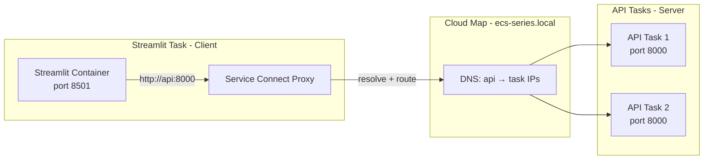
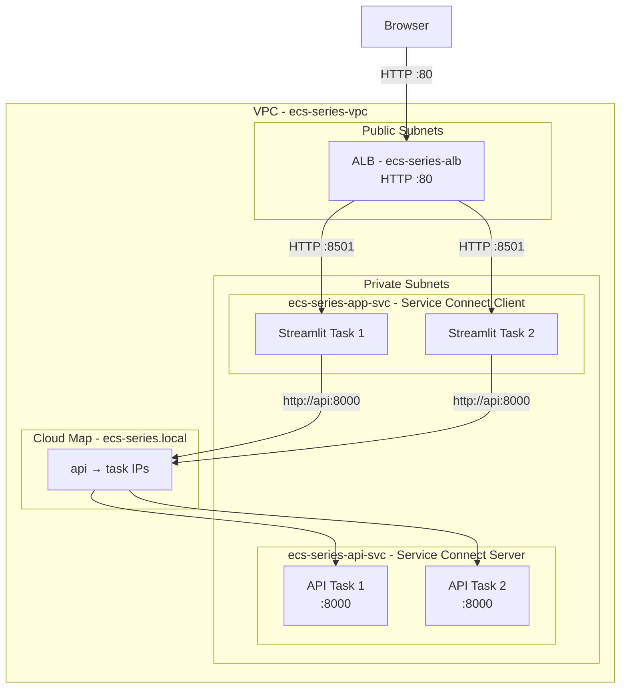

# Chapter 4 — Networking in ECS: awsvpc, Service Connect, and Cloud Map

In Chapter 3 we deployed a Streamlit app behind an ALB. Traffic flowed from the internet → ALB → task. That is **north-south** traffic (external to internal).

But what happens when one ECS service needs to talk to another? Hard-coding IP addresses is fragile — tasks come and go, IPs change. This chapter covers how ECS gives every task its own network identity, and how **Service Connect** plus **Cloud Map** give services stable, friendly names inside your cluster.

**Region:** `eu-north-1` (Stockholm)  
**Launch type:** Fargate  
**Inherited from Chapters 2–3:** `ecs-series-vpc`, `ecs-series-cluster`, `ecs-series-app-svc`

---

## What You'll Learn

- How `awsvpc` network mode gives each task its own ENI and IP address
- Why subnet IP planning matters with Fargate
- How security groups work at the task level
- What Service Connect is and how it simplifies service-to-service calls
- What Cloud Map does behind the scenes
- How to configure Service Connect on the shared cluster so all later chapters inherit it

---

## Theory: Networking in ECS

### Network Modes (A Quick Overview)

ECS supports several network modes, but **Fargate only supports `awsvpc`**. That is the mode we use throughout this series.

| Mode | Used with | How it works |
|---|---|---|
| `bridge` | EC2 only | Containers share the host's network stack |
| `host` | EC2 only | Container uses the host's network directly |
| `awsvpc` | Fargate (required) and EC2 | Each task gets its own ENI with a private IP |
| `none` | EC2 only | No networking configured |

> **Analogy:** `bridge` mode is a **shared dorm room** — everyone uses the same address. `awsvpc` mode gives each task its own **apartment with its own street address** (ENI + private IP).

### awsvpc Mode and ENI-per-Task

When a Fargate task starts in `awsvpc` mode, ECS creates an **Elastic Network Interface (ENI)** in the subnet you specify and assigns it a private IP address. The task's containers share that ENI.

This means:

- Each task has a **unique IP** within the VPC
- Security groups attach **directly to the task**, not the host
- The ALB registers task **IPs** (not instance IDs) in the target group
- You must place tasks in subnets with **enough free IP addresses**

> **Analogy:** Every task gets its own **mailbox on its own street**. The ALB knows the address and delivers mail (HTTP requests) directly to it.

#### IP Planning Tip

Each Fargate task consumes **one IP address** from the subnet. If you run 10 tasks in a `/24` subnet (251 usable IPs), you are fine. But in larger deployments, IP exhaustion in a subnet is a real constraint — plan subnet sizes accordingly.

### Security Groups at the Task Level

Because each task has its own ENI, you attach security groups **per service** (which applies to all tasks in that service). This gives you granular control:

- The ALB security group (`ecs-series-alb-sg`) allows inbound HTTP from the internet
- The app security group (`ecs-series-app-sg`) only allows inbound traffic from the ALB on port 8501
- A backend API security group can allow inbound only from the frontend service's security group

> **Analogy:** Security groups are **bouncers at each apartment door**. The frontend bouncer only lets in guests who came through the ALB lobby. The backend bouncer only lets in guests who came from the frontend apartment.

### The Service-to-Service Problem

In Chapter 3, external users reach Streamlit via the ALB. But imagine Streamlit needs to call a backend API service. You could:

1. **Hard-code the API task's IP** — breaks the moment the task restarts
2. **Use the ALB** — works, but adds latency and couples internal traffic to external routing
3. **Use DNS-based service discovery** — the right approach

ECS gives you two options for DNS-based discovery:

| Feature | What it does |
|---|---|
| **Service Discovery (Cloud Map)** | Registers service instances in a private DNS namespace |
| **Service Connect** | Cloud Map + built-in proxy + client-side load balancing |

We focus on **Service Connect** because it is the modern, recommended approach.

### Cloud Map — The Private Phonebook

**AWS Cloud Map** is a service discovery tool. It maintains a private DNS namespace (e.g., `ecs-series.local`) and registers each running task as a DNS record.

When you create a namespace `ecs-series.local`:
- A service named `api` becomes reachable at `api.ecs-series.local`
- When tasks start and stop, Cloud Map updates the records automatically

> **Analogy:** Cloud Map is the **building directory in the lobby**. Instead of memorizing apartment numbers, you look up "API Department" and the directory tells you where they are.

Cloud Map on its own requires your application to resolve DNS and handle load balancing across multiple IPs. That is where Service Connect adds value.

### Service Connect — The Smart Intercom System

**Amazon ECS Service Connect** builds on Cloud Map and adds:

1. **Friendly short names** — call `http://api:8000` instead of `http://api.ecs-series.local:8000`
2. **Automatic Envoy proxy** — a sidecar injected into each task handles routing
3. **Client-side load balancing** — traffic is distributed across healthy tasks automatically
4. **Observability** — request metrics and connection stats in the ECS console

When you configure a service as a Service Connect **client**, ECS injects a proxy container that intercepts outbound calls to configured service names and routes them correctly.

When you configure a service as a Service Connect **server**, it advertises its port under a friendly DNS name that other services can call.

> **Analogy:** Service Connect is the **smart intercom system** in the building. You press "API" on your apartment intercom — the system connects you to any available API apartment, handles busy signals, and logs the call.

### How It All Fits Together



---

## Hands-On: Configure Service Connect on the Shared Cluster

We will add a small Python API backend and wire it up with Service Connect. The Streamlit frontend (from Chapter 3) will call the API by name — `http://api:8000`.

All later chapters in this series inherit this Service Connect configuration.

### Prerequisites

- Chapters 2 and 3 completed
- `ecs-series-app-svc` running with 2 healthy tasks
- Docker and AWS CLI available locally

---

### Step 1 — Create the Cloud Map Namespace

1. Open **Cloud Map Console** → **Namespaces** → **Create namespace**.
2. Configure:
   - **Namespace type:** DNS-based service discovery
   - **Namespace name:** `ecs-series.local`
   - **VPC:** `ecs-series-vpc`
3. Create the namespace.

<!-- SCREENSHOT: Cloud Map Console > Namespaces showing ecs-series.local with type DNS and VPC ecs-series-vpc -->

Alternatively, Service Connect can create the namespace for you during service configuration — but creating it explicitly makes the setup easier to understand.

---

### Step 2 — Build and Push the API Service Image

Create a minimal FastAPI backend that returns JSON. This lives alongside the Streamlit app in the same ECR repository with a different tag.

**`main.py`**

```python
import os
from fastapi import FastAPI

app = FastAPI()
ROLE = os.getenv("ROLE", "api")

@app.get("/")
def root():
    return {
        "message": "Hello from the ECS API service!",
        "role": ROLE,
        "region": "eu-north-1"
    }

@app.get("/health")
def health():
    return {"status": "healthy"}
```

**`requirements.txt`**

```
fastapi==0.110.0
uvicorn==0.27.1
```

**`Dockerfile`**

```dockerfile
FROM python:3.11-slim

WORKDIR /app

COPY requirements.txt .
RUN pip install --no-cache-dir -r requirements.txt

COPY main.py .

EXPOSE 8000

CMD ["uvicorn", "main:app", "--host", "0.0.0.0", "--port", "8000"]
```

Build, tag, and push:

```bash
docker build -t ecs-series-api:local .

docker tag ecs-series-api:local \
  ACCOUNT_ID.dkr.ecr.eu-north-1.amazonaws.com/ecs-series-app:api-v1

docker push \
  ACCOUNT_ID.dkr.ecr.eu-north-1.amazonaws.com/ecs-series-app:api-v1
```

<!-- SCREENSHOT: ECR Console > ecs-series-app showing two image tags: v1 and api-v1 -->

Test locally:

```bash
docker run -p 8000:8000 ecs-series-api:local
curl http://localhost:8000/
```

---

### Step 3 — Create the API Task Definition and Service (Service Connect Server)

#### 3a. Task Definition

1. **ECS Console** → **Task definitions** → **Create new task definition**.
2. Configure:

| Setting | Value |
|---|---|
| Family | `ecs-series-api-td` |
| Launch type | Fargate |
| CPU / Memory | 0.25 vCPU / 0.5 GB |
| Execution role | `ecsTaskExecutionRole` |

3. Container:

| Setting | Value |
|---|---|
| Name | `api` |
| Image | `ACCOUNT_ID.dkr.ecr.eu-north-1.amazonaws.com/ecs-series-app:api-v1` |
| Port | `8000` |
| Env var | `ROLE=api` |

4. Create the task definition.

<!-- SCREENSHOT: Task definition ecs-series-api-td:1 showing container api on port 8000 -->

#### 3b. Security Group for the API

Create `ecs-series-api-sg` in `ecs-series-vpc`:

- **Inbound:** TCP 8000 from `ecs-series-app-sg` (only the Streamlit service can call the API)
- **Outbound:** Default (all traffic)

<!-- SCREENSHOT: Security group ecs-series-api-sg inbound rule showing TCP 8000 from ecs-series-app-sg -->

#### 3c. Create the API Service with Service Connect

1. **ECS Console** → **Clusters** → `ecs-series-cluster` → **Create** → **Service**.
2. Configure:

| Setting | Value |
|---|---|
| Task definition | `ecs-series-api-td:1` |
| Service name | `ecs-series-api-svc` |
| Desired tasks | `2` |

3. **Networking:**

| Setting | Value |
|---|---|
| VPC | `ecs-series-vpc` |
| Subnets | Both private subnets |
| Security group | `ecs-series-api-sg` |
| Public IP | OFF |

4. **Service Connect** — enable and configure:

| Setting | Value |
|---|---|
| Use Service Connect | **ON** |
| Namespace | `ecs-series.local` |
| Service Connect configuration | **Client side only** → turn OFF (this service is a server, not a client) |
| Port mapping | Port name: `api`, Discovery name: `api`, Port: `8000`, Client alias: `api` on port `8000` |

5. **Load balancing:** None (this service is internal only — no ALB).

6. Create the service.

<!-- SCREENSHOT: Create service wizard Service Connect section showing namespace ecs-series.local, port name api, discovery name api, port 8000 -->

Wait for 2 tasks to reach **RUNNING**.

<!-- SCREENSHOT: ecs-series-cluster Services tab showing both ecs-series-app-svc and ecs-series-api-svc with desired 2/2 running -->

---

### Step 4 — Update the Streamlit Service as a Service Connect Client

Now tell the Streamlit service it can reach `api` by name.

1. Go to **ECS Console** → **Clusters** → `ecs-series-cluster` → **Services** → `ecs-series-app-svc`.
2. Click **Update service**.
3. Under **Service Connect**, enable it:

| Setting | Value |
|---|---|
| Use Service Connect | **ON** |
| Namespace | `ecs-series.local` |
| Client-only configuration | Add client alias: **Port name** `api`, **Discovery name** `api`, **Port** `8000` |

4. Check **Force new deployment** so existing tasks are replaced with ones that have the Service Connect proxy injected.
5. Update the service.

<!-- SCREENSHOT: Update service wizard showing Service Connect client configuration with api alias on port 8000 -->

While the deployment rolls out, update the Streamlit app to call the API (optional but recommended for a visual demo). Add to `streamlit_app.py`:

```python
import requests

# ... existing code ...

if st.button("Call backend API via Service Connect"):
    try:
        response = requests.get("http://api:8000/", timeout=5)
        st.json(response.json())
    except Exception as e:
        st.error(f"Could not reach API: {e}")
```

Rebuild, push as `v2`, and update the task definition to use the new image tag. Or skip the UI button and verify with `curl` in Step 5 — both prove the same thing.

---

### Step 5 — Verify Service-to-Service Communication

#### 5a. Enable ECS Exec (one-time setup)

ECS Exec lets you open a shell inside a running container — useful for debugging.

1. Ensure the **SSM message channels** policy is attached to the task role (or create a task role with `AmazonSSMManagedInstanceCore`).
2. When updating the Streamlit service, check **Enable ECS Exec**.

#### 5b. Exec into a Streamlit Task and curl the API

```bash
# List running tasks
aws ecs list-tasks \
  --cluster ecs-series-cluster \
  --service-name ecs-series-app-svc \
  --region eu-north-1

# Exec into a task (replace TASK_ID)
aws ecs execute-command \
  --cluster ecs-series-cluster \
  --task TASK_ID \
  --container app \
  --interactive \
  --command "/bin/sh" \
  --region eu-north-1
```

Inside the container:

```bash
# Install curl if not present (slim image)
apt-get update && apt-get install -y curl

# Call the API by its Service Connect name
curl http://api:8000/
```

Expected response:

```json
{"message":"Hello from the ECS API service!","role":"api","region":"eu-north-1"}
```

<!-- SCREENSHOT: Terminal showing ECS Exec session with curl http://api:8000/ returning JSON response -->

You just called one ECS service from another using a **friendly DNS name** — no hard-coded IPs, no ALB in the middle.

#### 5c. Check the Service Connect Dashboard

1. Go to **ECS Console** → **Clusters** → `ecs-series-cluster`.
2. Open the **Service Connect** tab (or view it within each service).
3. Confirm you see:
   - Namespace: `ecs-series.local`
   - Server: `api` (from `ecs-series-api-svc`)
   - Client: `api` (from `ecs-series-app-svc`)

<!-- SCREENSHOT: ECS Console Service Connect tab showing namespace ecs-series.local with api server and client entries -->

---

### Step 6 — Verify End-to-End

Run through this checklist:

| Check | Expected result |
|---|---|
| `ecs-series-app-svc` tasks | 2/2 RUNNING |
| `ecs-series-api-svc` tasks | 2/2 RUNNING |
| ALB → Streamlit | Browser loads app at ALB DNS |
| Streamlit → API via Service Connect | `curl http://api:8000/` returns JSON from inside a Streamlit task |
| Cloud Map namespace | `ecs-series.local` exists with registered services |
| Security groups | API only accepts port 8000 from app SG |

<!-- SCREENSHOT: Final architecture overview — ECS cluster with both services running, Service Connect namespace visible, ALB healthy targets -->

---

## Architecture After Chapter 4



---

## Key Takeaways

- **`awsvpc` mode** gives every Fargate task its own ENI and IP — plan subnet sizes accordingly
- **Security groups** attach per service, giving you task-level firewall rules
- **Cloud Map** is the private DNS phonebook (`ecs-series.local`)
- **Service Connect** adds a proxy, friendly names, and client-side load balancing on top of Cloud Map
- Once configured on `ecs-series-cluster`, **every future chapter inherits this networking setup**

---

## What's Next

With the shared cluster, ALB, and Service Connect namespace in place, later chapters can focus on:

- Auto Scaling — scale tasks based on CPU, memory, or request count
- CI/CD — automate image builds and service deployments
- Observability — CloudWatch Container Insights, distributed tracing
- Secrets management — pulling credentials from Secrets Manager at runtime

The foundation is solid. Everything we build from here plugs into `ecs-series-cluster` with zero networking rework.
