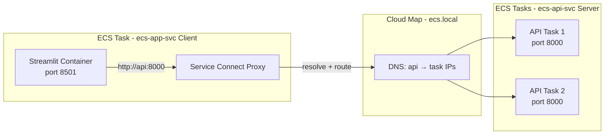
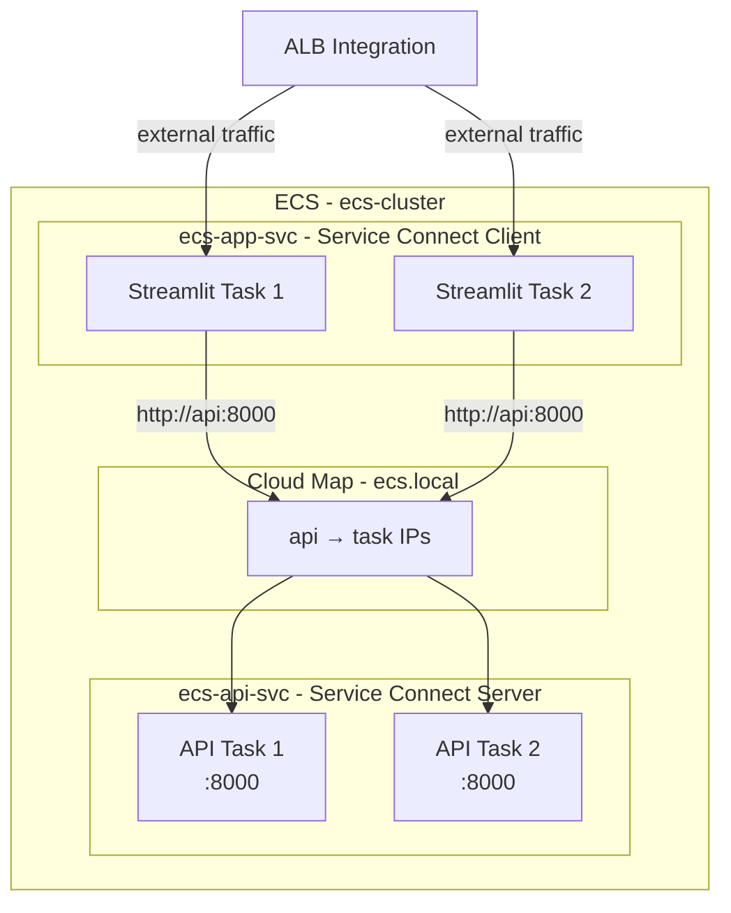

# Chapter 4 — Networking in ECS: awsvpc, Service Connect, and Cloud Map

In Chapter 3 we deployed a Streamlit service and verified tasks through the ECS console. External traffic reached tasks via a load balancer integration. That is **north-south** traffic.

But what happens when one ECS service needs to talk to another? Hard-coding task IP addresses is fragile — tasks restart and IPs change. This chapter covers **ECS networking features** that solve that: `awsvpc` mode, Service Connect, and Cloud Map.

**Region:** `eu-north-1` (or your preferred region)  
**Launch type:** Fargate  
**Inherited from Chapters 2–3:** `ecs-cluster`, `ecs-app-svc`

---

## What You'll Learn

- How `awsvpc` network mode gives each ECS task its own ENI and IP address
- Why subnet IP planning matters when scaling Fargate tasks
- How security groups attach to ECS services
- What Service Connect is and how it simplifies service-to-service calls
- How Cloud Map works behind Service Connect
- How to configure Service Connect entirely from the ECS console

---

## Theory: Networking in ECS

### Network Modes

ECS supports several network modes, but **Fargate only supports `awsvpc`**. That is the mode we use throughout this series.

| Mode | Used with | How it works |
|---|---|---|
| `bridge` | EC2 only | Containers share the host's network stack |
| `host` | EC2 only | Container uses the host's network directly |
| `awsvpc` | Fargate (required) and EC2 | Each task gets its own ENI with a private IP |
| `none` | EC2 only | No networking configured |

> **Analogy:** `bridge` mode is a **shared dorm room** — everyone uses the same address. `awsvpc` mode gives each task its own **apartment with its own street address** (ENI + private IP).

### awsvpc Mode and ENI-per-Task

When a Fargate task starts in `awsvpc` mode, ECS creates an **Elastic Network Interface (ENI)** in the subnet you specify and assigns it a private IP. The task's containers share that ENI.

This means:

- Each task has a **unique IP** within the VPC
- Security groups attach **directly to the task** via the service configuration
- Load balancer integrations register task **IPs** (not instance IDs)
- You must place tasks in subnets with **enough free IP addresses**

> **Analogy:** Every task gets its own **mailbox on its own street**.

Each Fargate task consumes **one IP address** from the subnet. Plan subnet sizes accordingly as you scale.

### Security Groups on ECS Services

When you create or update a service, you select security groups that apply to all tasks in that service. This is an ECS networking choice — not something you configure inside the task definition.

For our setup:

- `ecs-app-sg` — attached to the Streamlit service (allows inbound from the ALB)
- `ecs-api-sg` — attached to the API service (allows inbound on port 8000 from `ecs-app-sg` only)

> **Analogy:** Security groups are **bouncers at each apartment door** — configured once per service, applied to every task that service runs.

### The Service-to-Service Problem

In Chapter 3, external users reach Streamlit via a load balancer integration. But when Streamlit needs to call a backend API service, you could:

1. **Hard-code a task IP** — breaks the moment the task restarts
2. **Route through the ALB** — works, but adds latency and couples internal traffic to external routing
3. **Use ECS service discovery** — the right approach

ECS offers two DNS-based options:

| Feature | What it does |
|---|---|
| **Service Discovery (Cloud Map)** | Registers service instances in a private DNS namespace |
| **Service Connect** | Cloud Map + built-in proxy + client-side load balancing |

We focus on **Service Connect** — the modern, ECS-native approach.

### Cloud Map — The Private Phonebook

**AWS Cloud Map** maintains a private DNS namespace (e.g., `ecs.local`) and registers each running task as a DNS record. When tasks start and stop, records update automatically.

> **Analogy:** Cloud Map is the **building directory in the lobby**. Instead of memorizing apartment numbers, you look up "API Department."

You do not need to open the Cloud Map console separately — when you enable Service Connect on an ECS service, ECS creates and manages the namespace for you.

### Service Connect — The Smart Intercom System

**Amazon ECS Service Connect** builds on Cloud Map and adds:

1. **Friendly short names** — call `http://api:8000` instead of a full DNS name
2. **Automatic Envoy proxy** — injected into tasks that need it
3. **Client-side load balancing** — traffic distributed across healthy tasks
4. **Observability** — request metrics in the ECS console Service Connect tab

When you configure a service as a Service Connect **server**, it advertises its port under a discovery name (e.g., `api`).

When you configure a service as a Service Connect **client**, ECS injects a proxy that intercepts outbound calls to configured service names and routes them correctly.

> **Analogy:** Service Connect is the **smart intercom system**. Press "API" — the system connects you to any available API task, handles retries, and logs the call.

### How It All Fits Together



---

## Hands-On: Configure Service Connect on the Shared Cluster

We will add a second ECS service (`ecs-api-svc`) and wire it to the Streamlit frontend (`ecs-app-svc`) using Service Connect. All configuration happens in the **ECS console**.

All later chapters in this series inherit this Service Connect setup on `ecs-cluster`.

### Prerequisites

> *This is an ECS series. We assume you already have a VPC with private subnets, security groups (`ecs-app-sg`, `ecs-api-sg` allowing port 8000 from `ecs-app-sg`), and an ECR repo `ecs-app` with image tag `api-v1`. Chapter 1 covers that baseline.*

You also need:

- `ecs-cluster` with `ecs-app-svc` running (2/2 tasks from Chapter 3)
- API image URI: `ACCOUNT_ID.dkr.ecr.AWS_REGION.amazonaws.com/ecs-app:api-v1`

---

### Step 1 — Create the API Task Definition

1. Open **ECS Console** → **Task definitions** → **Create new task definition**.
2. Configure:

| Setting | Value |
|---|---|
| Family | `ecs-api-td` |
| Launch type | Fargate |
| CPU / Memory | 0.25 vCPU / 0.5 GB |
| Task execution role | `ecsTaskExecutionRole` |
| Network mode | awsvpc |

3. Add a container:

| Setting | Value |
|---|---|
| Name | `api` |
| Image | `ACCOUNT_ID.dkr.ecr.AWS_REGION.amazonaws.com/ecs-app:api-v1` |
| Port mapping | Container port `8000`, protocol TCP |
| Environment variable | Key: `ROLE`, Value: `api` |
| Log configuration | Auto-configure CloudWatch log group |

4. Create the task definition.

<!-- SCREENSHOT: ECS Console > Task definition ecs-api-td:1 showing container api on port 8000 -->

---

### Step 2 — Create the API Service with Service Connect (Server)

1. **ECS Console** → **Clusters** → `ecs-cluster` → **Create** → **Service**.
2. Configure:

| Setting | Value |
|---|---|
| Task definition | `ecs-api-td:1` |
| Service name | `ecs-api-svc` |
| Desired tasks | `2` |

3. **Networking** (select existing resources):

| Setting | Value |
|---|---|
| VPC | `ecs-vpc` |
| Subnets | Private subnets |
| Security group | `ecs-api-sg` |
| Public IP | OFF |

4. **Service Connect** — enable and configure as a **server**:

| Setting | Value |
|---|---|
| Use Service Connect | **ON** |
| Namespace | Create new: `ecs.local` (or select existing) |
| Port mapping | Port name: `api`, Discovery name: `api`, Port: `8000` |
| Client alias | `api` on port `8000` |

ECS creates the Cloud Map namespace `ecs.local` automatically when you specify it here — no separate Cloud Map console step needed.

5. **Load balancing:** None — this is an internal ECS service only.

6. Create the service.

<!-- SCREENSHOT: ECS Console > Create service Service Connect section showing namespace ecs.local, discovery name api, port 8000, server configuration -->

Wait for 2 tasks to reach **RUNNING**.

<!-- SCREENSHOT: ECS Console > ecs-cluster Services tab showing ecs-app-svc and ecs-api-svc both at 2/2 running -->

---

### Step 3 — Update the Streamlit Service as a Service Connect Client

Tell the existing Streamlit service it can reach `api` by name.

1. **ECS Console** → **Clusters** → `ecs-cluster` → **Services** → `ecs-app-svc` → **Update service**.
2. Under **Service Connect**, enable it:

| Setting | Value |
|---|---|
| Use Service Connect | **ON** |
| Namespace | `ecs.local` |
| Client configuration | Add client alias: Port name `api`, Discovery name `api`, Port `8000` |

3. Check **Force new deployment** — existing tasks must be replaced to receive the Service Connect proxy sidecar.
4. Update the service.

<!-- SCREENSHOT: ECS Console > Update service Service Connect section showing client alias api on port 8000 -->

5. Watch the deployment in the **Deployments** tab — old tasks drain, new tasks with the proxy sidecar come up.

<!-- SCREENSHOT: ECS Console > ecs-app-svc Deployments tab showing rolling update in progress -->

**Optional app change:** If your Streamlit app calls the API, add a button that hits `http://api:8000/`, rebuild the image as `v2`, and update the task definition revision. Or skip the UI change and verify with ECS Exec in Step 4 — both prove the same thing.

---

### Step 4 — Enable ECS Exec and Verify Service-to-Service Calls

ECS Exec lets you open a shell inside a running container — useful for verifying Service Connect from within a task.

1. When updating `ecs-app-svc`, check **Enable ECS Exec** (requires a task role with SSM permissions — attach `AmazonSSMManagedInstanceCore` if not already present).
2. Force a new deployment if you just enabled Exec.

**Exec into a Streamlit task:**

```bash
aws ecs list-tasks \
  --cluster ecs-cluster \
  --service-name ecs-app-svc \
  --region eu-north-1

aws ecs execute-command \
  --cluster ecs-cluster \
  --task TASK_ID \
  --container app \
  --interactive \
  --command "/bin/sh" \
  --region eu-north-1
```

Inside the container:

```bash
apt-get update && apt-get install -y curl
curl http://api:8000/
```

Expected response:

```json
{"message":"Hello from the ECS API service!","role":"api","region":"eu-north-1"}
```

<!-- SCREENSHOT: Terminal showing ECS Exec session with curl http://api:8000/ returning JSON -->

You called one ECS service from another using a **Service Connect name** — no hard-coded IPs, no load balancer in the middle.

---

### Step 5 — Review the Service Connect Dashboard

1. Go to **ECS Console** → **Clusters** → `ecs-cluster`.
2. Open the **Service Connect** tab.
3. Confirm:
   - Namespace: `ecs.local`
   - Server: `api` (from `ecs-api-svc`)
   - Client: `api` (from `ecs-app-svc`)

<!-- SCREENSHOT: ECS Console > ecs-cluster Service Connect tab showing namespace ecs.local with api server and client entries -->

4. Click into `ecs-api-svc` → **Service Connect** section to see port mappings and discovery configuration for that service.

<!-- SCREENSHOT: ECS Console > ecs-api-svc detail Service Connect section showing discovery name api and port 8000 -->

---

### Step 6 — Verify End-to-End from ECS

Run through this ECS-focused checklist:

| Check | Where to look | Expected |
|---|---|---|
| `ecs-app-svc` tasks | Cluster → Tasks | 2/2 RUNNING |
| `ecs-api-svc` tasks | Cluster → Tasks | 2/2 RUNNING |
| Service Connect namespace | Cluster → Service Connect tab | `ecs.local` active |
| Client → server call | ECS Exec + curl | JSON response from `http://api:8000/` |
| Service events | Both services → Events | No errors |

<!-- SCREENSHOT: ECS Console > ecs-cluster overview showing 2 services, 4 running tasks, Service Connect enabled -->

---

## Architecture After Chapter 4



---

## Key Takeaways

- **`awsvpc` mode** gives every Fargate task its own ENI and IP — plan subnet sizes as you scale
- **Security groups** attach per ECS service, controlling traffic to all tasks in that service
- **Cloud Map** is the private DNS registry — ECS creates it when you enable Service Connect
- **Service Connect** adds friendly names, a proxy sidecar, and client-side load balancing
- Once configured on `ecs-cluster`, **every future chapter inherits this networking setup**

---

## What's Next

With the ECS cluster, services, and Service Connect in place, later chapters can focus on:

- Auto Scaling — scale ECS services based on CPU, memory, or request count
- CI/CD — automate task definition revisions and service deployments
- Observability — CloudWatch Container Insights, distributed tracing
- Secrets management — pulling credentials from Secrets Manager at runtime

The ECS foundation is solid. Everything we build from here plugs into `ecs-cluster` with zero networking rework.
